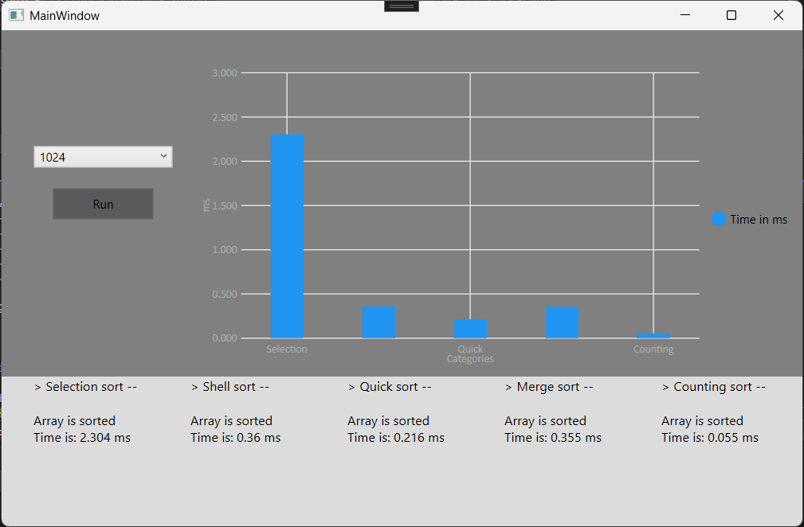

# Порівняння алгоритмів (десктопний застосунок на WPF)

Порівняння алгоритмів — це десктопний застосунок, розроблений на основі WPF та C#, для аналізу та візуалізації продуктивності різних алгоритмів сортування. Користувач може вибирати розміри масивів, запускати алгоритми сортування, вимірювати час їх виконання та порівнювати результати за допомогою динамічної стовпчикової діаграми. Результати також зберігаються у текстових файлах для подальшого аналізу.

## Основні можливості

- **Підтримувані алгоритми**  
  Реалізовано сортування вибором, Шелла, швидке сортування, сортування злиттям та сортування підрахунком.

- **Вибір розміру масиву**  
  Користувач може обрати розмір масиву (наприклад: 512, 1024..) через випадаюче меню.

- **Вимірювання продуктивності**  
  Вимірюється та відображається час виконання кожного алгоритму в мілісекундах.

- **Візуалізація**  
  Використовується бібліотека LiveCharts для створення стовпчикової діаграми, що порівнює час виконання алгоритмів.

- **Збереження результатів**  
  Відсортовані масиви та метрики продуктивності записуються у текстові файли (наприклад, `file_1024.txt`).

## Використані технології

- **C#** та **WPF** (.NET)
- **XAML** для дизайну інтерфейсу
- **LiveCharts.Wpf** для побудови діаграм
- Об’єктно-орієнтоване програмування (інкапсуляція, модульність)
- Робота з файлами (читання та запис)
- Обробка винятків
- Реалізація алгоритмів сортування

## Структура проєкту

- `MainWindow.xaml` — головне вікно застосунку з інтерфейсом користувача (випадаюче меню, кнопка запуску, текстові поля, діаграма).
- `MainWindow.xaml.cs` — логіка взаємодії з користувачем, виконання алгоритмів, оновлення діаграми та операції з файлами.
- `Algorithms.cs` — містить реалізації алгоритмів сортування та допоміжні методи для створення масивів, роботи з файлами та перевірки сортування.

## Знімок екрану

### Головне вікно



## Як запустити

1. Клонуйте репозиторій на локальну машину:
   ```bash
   https://github.com/TanyaTverdun/Algorithms_Comparison.git
   ```
2. Відкрийте рішення (`Algorithms_Comparison.sln`) у **Visual Studio**.
3. Встановіть пакет **LiveCharts.Wpf** через NuGet:
   ```bash
   Install-Package LiveCharts.Wpf
   ```
4. Зберіть та запустіть проєкт.
5. Виберіть розмір масиву, натисніть **Старт** і перегляньте результати в текстових полях, на діаграмі та у вихідному файлі.

## Авторка

**Тетяна Твердун**  
Студентка спеціальності "Інженерія програмного забезпечення", група ПЗ-22  
Національний університет "Львівська політехніка"

## Примітки

- Застосунок використовує тимчасовий файл (`temp`) для зберігання початкового масиву, щоб забезпечити однаковий вхід для всіх алгоритмів.
- Час виконання залежить від продуктивності системи та розміру масиву.
